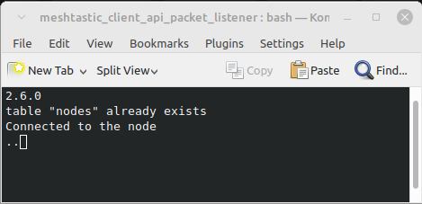

# meshtastic_client_api_packet_listener
A meshtastic packet listener in Python, using tcp client api, sending some bot-like responses, reporting to the console and saving node info to sqlite

# Setup environment
Below steps should be performed from the source folder.
## Setup virtual environment
`$ python3 -m venv venv`

## Activate environment. This changes the prompt to: (venv)... $
`$ source venv/bin/activate `

## Install the python meshtastic module
`$ pip3 install meshtastic`

## Run the script
`$ ./run_main.sh`
